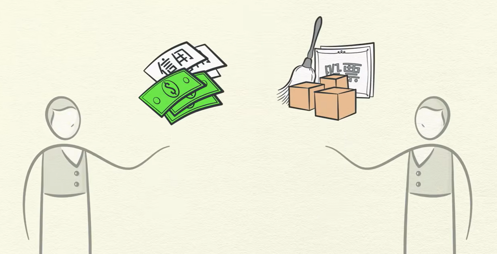

# 资产和负债

什么是资产和负债？通俗来讲，资产就是能给你带来经济收入的产品，而负债就是不能给你带来经济收入的产品。

关于什么产品才能让你赚到钱，这就是和投资相关的。

要了解什么是资产和负债，得先了解经济机器是怎样运行的。

## 什么是经济？

经济虽然看起来复杂，但其实是以简单和机械的方式在运行。由于人之间需要相互交易，形成了三股主要的经济动力：

1、生产率的提高；2、短期债务周期；3、长期债务周期。

### 交易

经济不过是无数交易的总和。交易十分简单且一直在发生，你的每一次购买都是一次交易。

在每次交易中，买方使用 `货币` 或 `信用` 向卖方交易 `商品`、`服务` 或 `金融资产`

    

